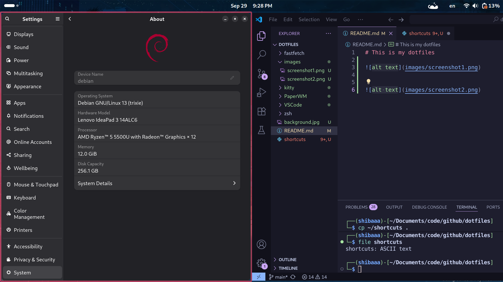
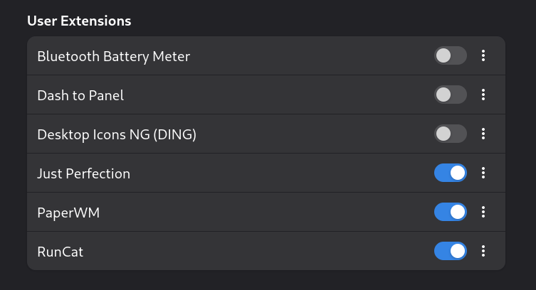

# 🌸 My Dotfiles  

## 📸 Screenshots  

   

   

---

## 🧩 GNOME Extensions  

  

---

## ⌨️ Shortcuts  

### 🔧 System  
- **Win + Enter** → Power Off  

### 🖥️ Applications  
- **Win + T** → Terminal  
- **Win + K** → Kitty  
- **Win + Space** → Unikey  

### 🪟 Window Manager  
- **Win + D** → Close Window  
- **Win + R** → Resize Window  
- **Win + F** → Fullscreen  
